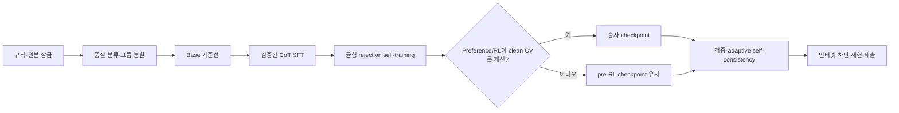

# Deep Learning Challenge 2026 — 조사·실행 계획 및 선행 구현

기준 시각: **2026-08-11 KST**
대상 대회: Kaggle [Deep Learning Challenge 2026](https://www.kaggle.com/competitions/deep-learning-challenge-2026)
고정 베이스: [Qwen/Qwen2.5-3B-Instruct](https://huggingface.co/Qwen/Qwen2.5-3B-Instruct)

> **현재 운영 계약:** 로컬 구현 루트는 `$PROJECT`, 데이터 루트는
> `$PROJECT/deep-learning-challenge-2026`이다. 2026-08-03 14:00 정제본인
> 831행 leaderboard와 627개 train exclusion ID를 사용한다. split v4는 재생성하지
> 않고 hard-group exclusion overlay를 적용한다. training cache-off와 eval KV-cache-on을
> 분리한 source/B0 pair를 매 GPU run에 결속한다. answer-only QLoRA는 같은 fold의 당시
> base 1,210/2,942(41.1285%) 대비 627/2,942(21.3120%)로 유의하게 열세여서 fold 1--4
> 전에 중단했다. parser v2를 포함한 새 source/B0 tag `20260810T234907KST`에서 base를
> 다시 생성해 1,653/2,942(56.1863%), parser `ok/conflict/invalid=2705/3/234`를
> selection-eligible v2 bundle로 확정했다. 다음 candidate인 verified concise rationale는
> CPU-only corpus/audit/SFT-preflight와 adapter provenance 경로에 더해 derive-then-verify
> `teacher-pilot-v3` profile을 구현했다. 동일 128행 live pilot은 initial 4호출 중 2개만
> parsed되고 local 승인 52/128로 103/128 gate에 미달해 repair 없이 fail-closed됐다. v4는
> v3와의 차이를 cardinality/ID/order 사전 확인 한 문장으로 제한한 policy-bound candidate다.
> v4 organizer-data plan은 새 source freeze, qualified synthetic replay·2×32 canary, immutable
> authorization sidecar 전에는 만들 수 없다. private corpus 생성·QLoRA·모델 점수는 실행하지
> 않았다. 정확한 실행 계약은
> [Gate B CPU-ready 런북](docs/10_GATE_B_CPU_READY_RUNBOOK.md)과
> [synthetic teacher harness v1](docs/13_SYNTHETIC_TEACHER_HARNESS_V1.md),
> [v4 실행 런북](docs/14_GATE_B_TEACHER_V4_RUNBOOK.md)에 있다.

## 한 줄 결론

이 대회의 가장 유망한 주 경로는 **깨끗한 그룹 분할 → 정답과 풀이가 검증된 간결한 CoT로 QLoRA/LoRA SFT → 같은 베이스 모델의 rejection self-training → 제한적인 preference/RLVR 실험 → 정수 파서·로컬 계산 검증·adaptive self-consistency**이다.

기법 수를 늘리는 것보다 다음 세 가지가 성패를 좌우한다.

1. 공개 리더보드와 구조적으로 닮은 문제가 많은 데이터에서 **템플릿 중복 누출을 막는 내부 검증**
2. 결측·오표기·불완전 문제를 걸러 내는 **데이터 품질 관리**
3. 인터넷이 완전히 차단된 상태에서도 동일 제출을 재생성하는 **end-to-end 재현성**

## 현재 판정

| 항목 | 판정 | 근거 |
|---|---|---|
| 최신 로컬 데이터 계약 | **완료** | train 17,000행, filtered leaderboard 831행, organizer exclusion 627 ID의 hash·schema·row 검증 |
| 영상 파일 기술 감식 | 완료 | 전체 12,889프레임 디코드, 스트림·해시·슬라이드 전환 감사 |
| 영상 슬라이드 내용 분석 | 완료 | 13개 구간의 규칙·제출물·평가·일정 내용을 화면 근거로 기록 |
| 영상 음성의 완전 전사 | **미완료** | 내장/동봉 자막과 로컬 ASR 모델이 없어 음성 발화를 검증 가능한 방식으로 전사할 수 없음 |
| Kaggle authenticated API 재검증 | **완료** | 참가 중인 slug·Rules/Data/Evaluation·파일 목록·현재 제출 가능 횟수(5)를 읽기 전용 확인; 파일 목록에는 sample submission이 없음 |
| 논문·방법론 조사 | 완료 | SFT, LoRA/QLoRA, self-training, preference, GRPO/RLVR, verifier, TIR, test-time compute, 오염 감사 |
| model-free Gate A | **READY** | strict loader, filtered audit, split v4 overlay, parser, grouped evaluation, voting, uppercase-ID submission, provenance와 회귀 테스트 |
| 모델·토크나이저 preflight | **Gate B0 READY** | pinned tokenizer와 2개 full weight shard/commit, CUDA/BF16/NF4 QLoRA runtime, physical VRAM preflight와 cache-on local synthetic smoke를 실제 target GPU에서 green으로 확인했다. source가 바뀌면 새 pair를 요구한다. |
| 실제 QLoRA 학습·모델 추론 | **base current-source 완료 / answer-only QLoRA 중단 / rationale 미실행** | answer-only QLoRA는 627/2,942(21.3120%)로 탈락했다. parser v2 current-source base는 `20260810T234907KST`에서 1,653/2,942(56.1863%)로 재현되어 selection evidence가 됐다. concise-rationale 경로는 CPU 구현·테스트만 완료했고 실제 corpus·학습·점수는 없다. |

따라서 **Gate A는 READY**이고 Gate B0 환경도 실제 green이다. answer-only QLoRA candidate는
비용 게이트에서 탈락했고, parser v2 current-source base는 새 generation으로 재현됐다.
selection/freeze/holdout은 concise-rationale 같은 새 candidate가 fold 0 harm screen과 complete
OOF를 통과하기 전까지 계속 잠겨 있다. 다음 GPU workload도 현재 코드·문서를 반영한 새 source
manifest와 preflight/smoke, 직전 read-only VRAM 조건, versioned no-overwrite target을 모두
확인한 뒤에만 실행한다. 구현·테스트의 최종 상태는
[선행 구현 및 검증 상태](docs/09_IMPLEMENTATION_STATUS.md)에 기록한다.

## 가장 중요한 데이터 발견

- 현재 입력 파일은 `deep_chal_math_train.csv`, `deep_chal_math_leaderboard_filtered.csv`, `train_filtered_ids.csv`다. 과거 1,000행 leaderboard는 역사적 감사 근거일 뿐 현재 제출 ID source가 아니다.
- train 17,000행의 답은 모두 canonical signed integer지만, 문제 품질은 균일하지 않다.
- 재현 가능한 audit v3에서 train 내부 math-aware 중복은 4그룹/8행, 좁은 source-format 중복은 8그룹/16행이다. 별도의 초기 공격적 탐색에서는 13개 후보 그룹이 나왔으며, 정의가 다르므로 수치를 합치지 않는다. 최소 한 쌍은 같은 문제에 서로 다른 답이 붙은 명백한 라벨 충돌이다.
- 최신 filtered audit의 development CV는 14,736행이다. organizer 627 ID를 hard group으로 확장하면 총 629행이 제외되고 전체 eligible은 16,371행이다.
- pinned tokenizer와 같은 시스템 프롬프트 기준 CV chat 입력 최대는 1,119토큰, filtered leaderboard inference 입력 최대는 1,276토큰이다. 현재 12GB 시작 config는 sequence length 2,048로 고정한다.
- 과거 raw leaderboard의 malformed ` answer` header는 제한적으로 읽기만 한다. 현재 filtered 입력 header는 `id,question`이고, 제출은 authenticated Rules/Evaluation로 확인된 `ID,answer`를 기본 schema로 사용한다. 현재 authenticated 파일 목록에는 sample CSV가 없다.

자세한 수치와 예외 목록은 [데이터셋 포렌식](docs/02_DATASET_FORENSICS.md)에 있다.

## 권장 진행 순서

### 0. 규칙과 증거 잠금

- Kaggle Rules·Data·Evaluation·Submission을 token-authenticated API로 읽기 전용 확인했고, 응답 hash와 파일 목록을 artifact로 보존했다.
- 공개·동등 접근 가능한 외부 데이터와 상용 teacher의 **training-data 생성**은 규칙상 허용됐다. leaderboard/test 입력은 금지다. 로컬 Python/SymPy와 same-base multi-adapter/checkpoint 결합은 서면 확인 전 비활성화하며, Kaggle upload는 사용자의 명시 요청 없이는 하지 않는다.
- 원본 CSV와 영상 해시를 manifest에 고정한다.

### 1. 평가 기반부터 만든다

- 정수 answer parser와 submission validator를 모델보다 먼저 구현한다.
- train을 정규화·템플릿 cluster 단위로 나눠 반복 선택용 development 5-fold와 한 번만 여는 sealed final holdout을 만든다.
- 원본 greedy, direct answer, concise CoT, sampling N별 `greedy/pass@N/majority@N`을 측정한다.
- 리더보드는 최종 sanity check에만 사용하고 하이퍼파라미터 탐색기로 쓰지 않는다.

### 2. 주력 모델 경로

- 현재 RTX 4070 SUPER 12GB의 첫 실행은 NF4 double-quant/BF16 compute, seq 2,048, microbatch 1, gradient accumulation 16, rank 16/alpha 32, gradient checkpointing on으로 시작한다. training은 `use_cache=false`를 유지하고, `model.eval()`의 직렬 generation은 KV cache를 명시적으로 켠다.
- rank 32나 4K sequence는 실제 free-VRAM smoke와 개발 성능 근거를 통과한 뒤에만 별도 config로 비교한다. full BF16 fine-tuning은 이 12GB 장비의 경로가 아니다.
- 제공 train의 정답만 있는 예제를 그대로 장황한 풀이로 꾸미지 않는다. 같은 Qwen 베이스에서 여러 풀이를 생성하고 정답·계산을 검증해 간결한 풀이만 채택한다.
- 절차적으로 생성한 integer-only 문제와 라이선스·출처가 명확한 공개 데이터만 단계적으로 추가한다.
- SFT 다음은 STaR/rejection sampling과 난이도 균형을 우선하고, KTO/ORPO/DPO와 GRPO는 각각 고정 검증에서 실제 이득이 있을 때만 유지한다.

### 3. 추론과 제출

- greedy → 4개 후보 → 합의가 약한 문제만 8/16/32개로 늘리는 adaptive sampling을 사용한다.
- 답 수준 voting, 로컬 산술·대입 검증, 필요 시 같은 Qwen 베이스에서 학습한 selector를 결합한다.
- raw generation, 추출 답, 후보 표, seed, latency를 모두 저장한다.
- 인터넷 차단 dry-run에서 모델 로드부터 `submission.csv`까지 다시 만들어 해시와 행 수를 검증한다.

### 4. 발표 준비

- 모든 실험에 데이터 manifest, config, Git SHA, 환경 lock, 모델/adapter checksum, seed, 비용, 실패 이유를 남긴다.
- 발표는 최고 점수 하나가 아니라 **어떤 실패를 어떻게 찾아 제거했고, 어느 단계가 얼마를 올렸는지**를 ablation과 오류 사례로 증명한다.

## 문서 지도

1. [증거·대회 규칙 감사](docs/01_EVIDENCE_AND_COMPETITION_AUDIT.md)
   원본 manifest, 영상 타임라인, 현재 확인된 규칙, 출처 간 불일치와 검증 한계
2. [데이터셋 포렌식](docs/02_DATASET_FORENSICS.md)
   행 수·분포·토큰 길이·중복·유사도·이상치, 품질 tier와 안전한 분할 설계
3. [방법론·논문 지도](docs/03_METHODS_AND_LITERATURE.md)
   SFT부터 RLVR·도구 사용·test-time compute까지 근거, 기대효과, 비용, 규칙 위험
4. [실험·학습 마스터 플랜](docs/04_EXPERIMENT_AND_TRAINING_PLAN.md)
   baseline부터 최종 모델 freeze까지 단계별 실험표, 승격·중단 게이트, compute별 트랙
5. [오프라인 추론·제출·재현성](docs/05_INFERENCE_SUBMISSION_REPRODUCIBILITY.md)
   parser, voting, verifier, sandbox, submission 검증, organizer 재실행 패키지
6. [일정·리스크·발표 계획](docs/06_OPERATIONS_SCHEDULE_PRESENTATION.md)
   31일 운영 캘린더, 역할, 실험 원장, 리스크 레지스터, 발표 평가 대응
7. [운영진 규칙 확인 질문서](docs/07_RULE_CLARIFICATION.md)
   Discord/Kaggle에 그대로 보낼 수 있는 짧은 질문과 답변별 의사결정
8. [출처 목록](docs/08_SOURCES.md)
   공식 모델·라이선스·논문·공개 데이터 링크와 사용 목적
9. [선행 구현 및 검증 상태](docs/09_IMPLEMENTATION_STATUS.md)
   실제 구현 모듈, audit/split/tokenizer 산출물, 테스트·커버리지, 재현 명령과 남은 blocker
10. [Gate B CPU-ready 실행 런북](docs/10_GATE_B_CPU_READY_RUNBOOK.md)
    현재 WSL/RTX 4070 SUPER에서 CPU 검증부터 5-fold OOF freeze, one-shot holdout,
    filtered leaderboard 제출까지 그대로 실행할 명령과 중단 조건
11. [지속 실행 체크리스트와 공개 저장소 경계](docs/11_EXECUTION_CONTINUATION_PLAN.md)
    중단 후 재개 순서, GPU·holdout·submission gate, Git 공개 제외 대상을 고정
12. [새 세션 시작용 상세 handoff prompt](docs/12_NEW_SESSION_START_PROMPT.md)
    새 세션에 그대로 붙여넣는 시작 지시문, 현재 snapshot, CPU/GPU 진입·중단 조건

## 절대 하지 않을 것

- 금지된 Qwen2.5-Math, DeepSeek-R1, Llama 계열 가중치의 merge·ensemble·추론 사용
- leaderboard/test 문제를 외부 상용 API나 다른 모델에 넣어 답 생성
- leaderboard 질문을 합성 데이터 seed, self-training prompt 또는 training set으로 사용
- 공개 리더보드 한 번의 상승만으로 방법을 채택
- 출처·라이선스·생성 모델을 알 수 없는 대규모 CoT dump를 무검증 투입
- parser 실패를 조용히 0으로 대체
- 인터넷 연결·다운로드 cache에 의존한 상태로 최종 추론
- 영상 음성을 전사하지 못한 상태에서 “영상 전체 발언을 완전 분석했다”고 주장

## 구현 단계별 체크포인트

- **A — model-free 기반:** strict loader, manifest, quality flags, 안전한 group split, parser, grouped evaluator, voting, submission writer/validator를 구현·테스트했다. **현재 완료 상태**다.
- **B — organizer-only 단일 adapter:** fold 0 base와 answer-only QLoRA를 완료했다. answer-only target은 출력을 7-token 수준으로 축약했지만 추론 성능을 훼손해 21.3120%로 탈락했다. parser v2 current-source base는 56.1863%로 재실행·검증했다. ChatGPT 로그인 Codex teacher의 question-only immutable ledger, local exact-match finalizer, 64→60 logical-audit 및 resume gate를 구현했다. historic v1은 111/128·17 exhaustion, v2는 first pass 105/128 뒤 106/128·7 exhaustion으로 fail-closed됐다. v3도 동일 128행 initial에서 호출 2/4만 parsed되고 52/128 승인에 그쳐 103/128 gate 전에 중단했다. 세 ledger는 재개하지 않는다. source bank·logical audit·GPU와 concise-rationale 모델 점수·holdout·leaderboard prediction은 없다. v4 candidate는 synthetic harness의 committed CPU verification, v4-qualified replay, v4-qualified 2×32 canary, immutable authorization sidecar를 모두 통과해야 organizer-data plan/run을 시작할 수 있다.
- **C — 확장:** 규칙상 허용된 외부 공개 데이터와 training-only teacher rationale도 provenance/오염/품질 gate 뒤에만 쓴다. Python/SymPy TIR과 same-base 다중 adapter/checkpoint 결합은 서면 확인 전 비활성화한다.

따라서 모든 질문의 답이 올 때까지 안전한 기반 구현을 멈추지는 않지만, 답이 없는 기능을 묵시적으로 허용하지도 않는다.

이 저장소의 기존 `NUL`/`NU_` 파일은 작업 시작 전부터 존재한 사용자 파일이므로 수정하거나 삭제하지 않았다.

## 공개 저장소와 라이선스

이 공개 저장소에는 코드·테스트·문서·재현 명령만 포함한다. Kaggle 원본 데이터, 데이터
파생 artifact, 모델/checkpoint, prediction/submission, API token과 로컬 개인 파일은
`.gitignore`로 제외한다. 대회 데이터는 Kaggle에서 직접 받아야 하며, raw data를 이
저장소에 올리지 않는다.

코드는 [GNU General Public License v3.0](LICENSE)로 배포한다.
